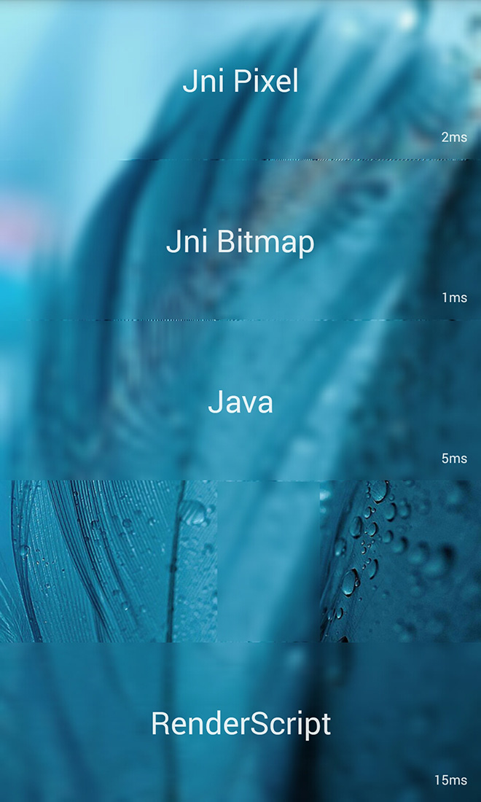

[](https://android-arsenal.com/details/1/1464)

[`中文`](README-ZH.md) [`English`](README.md) 

ImageBlurring
=============

Android 中通过 Java 与 JNI 分别进行图片模糊；并且进行比较其运算速度。


## Thanks
[blurring](https://github.com/paveldudka/blurring)


## 相关文章

*  [csdn](http://blog.csdn.net/qiujuer/article/details/24282047)


## 演示APK

*  [`BlurApp`](https://github.com/qiujuer/ImageBlurring/raw/master/release/blur-app.apk)


## 备注消息

已集成到新项目：[Genius-Android](https://github.com/qiujuer/Genius-Android.git)


## Screenshots

##### BLUR


##### Animation


## 四种方式

* `RenderScript`
  > *  调用 Android 自带的 `RenderScript` 类进行图片模糊
  > *  其模糊速度一般，与直接在Java层模糊区别不大
  > *  我这边调试只能在 `4.4` 以上运行，理论上是 `Android 17` 以上都行

* `Fast Blur`
  > *  Java层进行模糊
  > *  `Fast Blur` 是国外一位开发者发明的模糊方法
  > *  `Fast Blur` 原名是 堆栈模糊

* `JniArray`
  > *  其模糊规则是 `堆栈模糊` 的 C 语言实现
  > *  在 JNI 层进行模糊，然后传回模糊后的数据
  > *  在 Java 层对图片类解析得到 像素点 数组传入到 JNI 层
  > *  JNI 层对像素点集合进行模糊，模糊后传回

* `JniBitMap`
  > *  其模糊规则是 `堆栈模糊` 的 C 语言实现
  > *  在 JNI 层进行模糊，然后传回模糊后的数据
  > *  在 JNI 层直接对图片模糊，模糊后传回


## 你需要它

开发项目, 项目导入到 `Android Studio`，`Gradle` version 1.2.3 => gradle.2.8

项目里边含有一个实例项目，项目中有 JNI 的源码实现，以及 JNI 的生成文件。

'Eclipse' 中无法直接导入项目，请先建立一个项目按照对应目录替换到自己项目中。


## 反馈

在使用中有任何问题，欢迎能及时反馈给我，可以用以下联系方式跟我交流

* 邮件：qiujuer@live.cn
* QQ： 756069544
* Weibo： [@qiujuer](http://weibo.com/qiujuer)
* 网站：[www.qiujuer.net](http://www.qiujuer.net)


## 捐助我

在兴趣的驱动下,写一个`免费`的东西，有欣喜，也还有汗水，希望你喜欢我的作品，同时也能支持一下。
当然，有钱捧个钱场（支付宝: `qiujuer@live.cn` ）；没钱捧个人场，谢谢各位。


## 关于我

```javascript
  var info = {
    nickName  : "qiujuer",
    site : "http://www.qiujuer.net"
  }
```


License
--------

    Copyright 2014-2016 Qiujuer.

    Licensed under the Apache License, Version 2.0 (the "License");
    you may not use this file except in compliance with the License.
    You may obtain a copy of the License at

       http://www.apache.org/licenses/LICENSE-2.0

    Unless required by applicable law or agreed to in writing, software
    distributed under the License is distributed on an "AS IS" BASIS,
    WITHOUT WARRANTIES OR CONDITIONS OF ANY KIND, either express or implied.
    See the License for the specific language governing permissions and
    limitations under the License.

